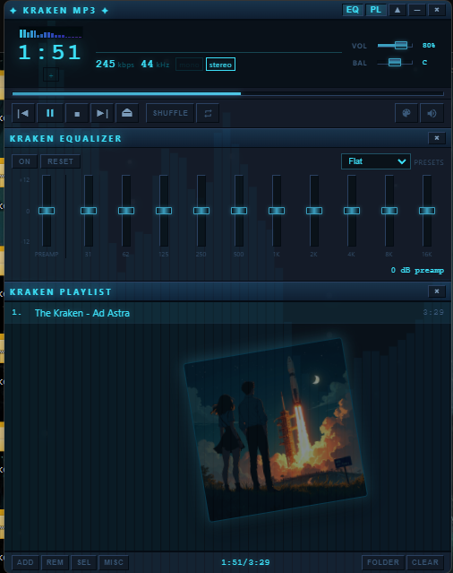
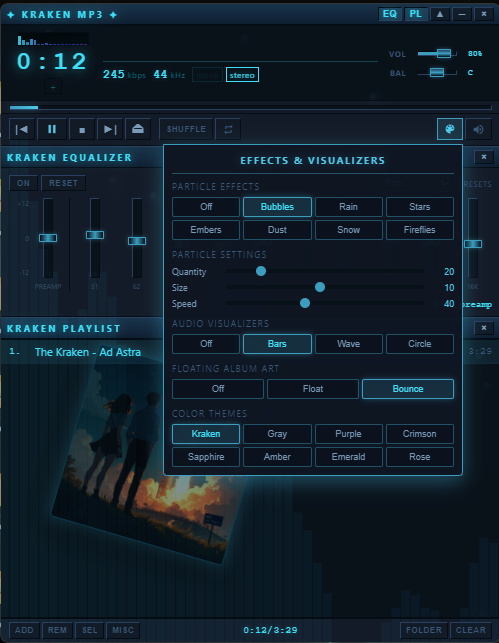

# Kraken MP3 (Winamp Edition)

A Winamp-style desktop music player with ocean/Kraken theming — 10-band EQ, audio visualizers, particle effects, and floating album art behind the playlist.

## Demo

[](https://youtube.com/shorts/t21i5fS1UZY)

**[▶ Watch on YouTube Shorts](https://youtube.com/shorts/t21i5fS1UZY)** — floating album art, visualizers, and the Winamp-style UI in motion.

## Screenshots





## Download

**[Kraken MP3 Setup 1.0.0](https://github.com/krakenunbound/kraken-mp3-winamp/releases/latest)** — Windows installer (NSIS)

Also available: portable **`Kraken MP3 1.0.0.exe`** on the [Releases](https://github.com/krakenunbound/kraken-mp3-winamp/releases) page.

After building locally, the latest installers are also copied to the **`Install File`** folder in this repo.

## User guide

**[USER_GUIDE.md](USER_GUIDE.md)** — installation, supported formats, playlist/EQ/effects, shortcuts, folders, and troubleshooting.

## Supported formats

| Extension | In-app playback | Optional installer file association |
|-----------|-----------------|-------------------------------------|
| `.mp3` `.flac` `.wav` `.ogg` `.m4a` `.aac` | Yes | Yes |
| `.wma` `.opus` | Yes | No (open via File → Open or Open with) |

## Bonus track

The installer includes **“Ad Astra” by The Kraken** (~7 MB). On first launch it is copied to:

`Documents\Kraken MP3\Music\Ad Astra.mp3`

and loaded automatically so you can hear the player immediately.

## Features

- **Winamp-style UI** — Main, EQ, and Playlist panels (EQ / PL toggles)
- **10-band graphic EQ** — Presets including Flat, Rock, Pop, Jazz, and more
- **Visualizers** — Bars, wave, circle + mini LCD visualizer
- **Particle effects** — Bubbles, rain, stars, embers, dust, snow, fireflies
- **Floating album art** — Semi-transparent cover in the playlist (Float / Bounce modes)
- **Color themes** — Kraken, grayscale, purple, crimson, and more
- **File associations** — Optional during install (see table above)

## Keyboard shortcuts

| Key | Action |
|-----|--------|
| `Space` | Play / Pause |
| `←` / `→` | Seek ±5s |
| `Ctrl+←` / `Ctrl+→` | Previous / Next track |
| `↑` / `↓` | Volume |
| `M` | Mute |
| `S` | Shuffle |
| `R` | Repeat |
| `Ctrl+O` | Open files |
| `~` | Effects menu |
| `F12` | DevTools |

Full list: [USER_GUIDE.md](USER_GUIDE.md#keyboard-shortcuts).

## Development

```bash
git clone https://github.com/krakenunbound/kraken-mp3-winamp.git
cd kraken-mp3-winamp
npm install
npm start
npm run build:win
```

Project notes for contributors: [ABOUT.md](ABOUT.md).

## Tech

- Electron 28
- music-metadata
- HTML5 Audio + Web Audio API

## Credits

**Kraken MP3 (Winamp Edition)** — design, code, art direction, and release by **[The Kraken](https://github.com/krakenunbound)** (Kraken Unbound).

Bonus track **“Ad Astra”** — written and performed by The Kraken; included with permission for distribution with this player.

## License

MIT — see [LICENSE](LICENSE). Copyright © 2026 The Kraken (Kraken Unbound).
