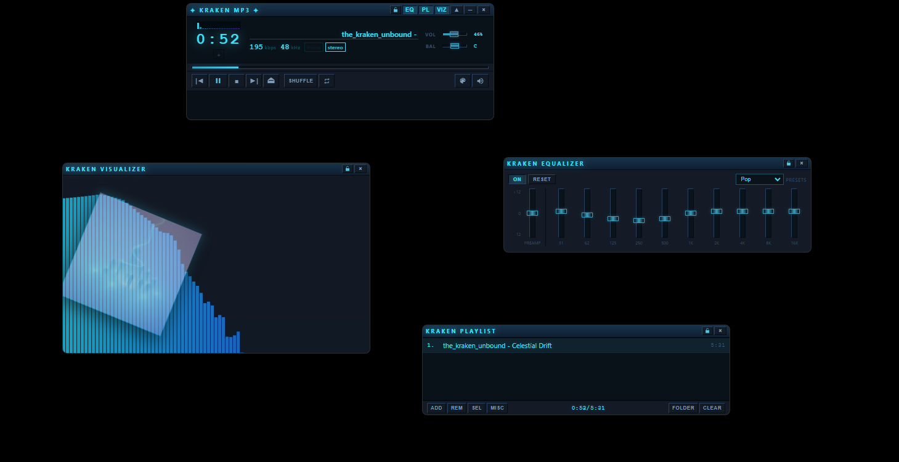
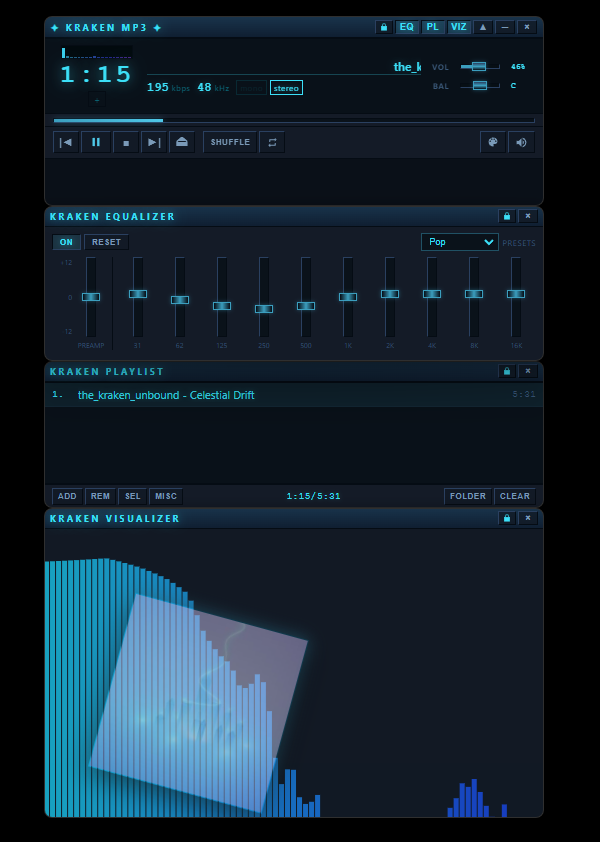

# Kraken MP3 (v2)

Multi-window desktop player — magnetic docking, standalone visualizer, 10-band EQ, particle effects, and Kraken/ocean themes.

## Why Kraken MP3 exists

Kraken MP3 began with a simple idea: make a modern Windows music player with some of the spirit of Winamp, without turning it into a bloated platform. It plays local music, stays easy to understand, and adds the useful extras—dockable panels, an equalizer, playlists, themes, and visualizers—without ads, telemetry, bundled junk, or unnecessary background services.

The source is public so the player and its installer can be inspected, built, and improved by anyone.

> **Classic v1** (single-window Kraken MP3) lives in a **separate repo**: [kraken-mp3](https://github.com/krakenunbound/kraken-mp3). See [docs/V1_VS_V2.md](docs/V1_VS_V2.md).

## Download (v2)

| Asset | Link |
|-------|------|
| **Windows installer (recommended)** | [Kraken MP3 — Latest release](https://github.com/krakenunbound/kraken-mp3-winamp/releases/latest) |
| **Portable .exe** | Same [Releases](https://github.com/krakenunbound/kraken-mp3-winamp/releases/latest) page |
| **Local build copy** | `Install File/` after `npm run build:v2:win` |

## Documentation

| Guide | Link |
|-------|------|
| **v2 user guide** (install, docking, shortcuts) | [docs/V2_USER_GUIDE.md](docs/V2_USER_GUIDE.md) |
| **v1 vs v2** (repos, installers, which to use) | [docs/V1_VS_V2.md](docs/V1_VS_V2.md) |
| **v2 changelog** | [CHANGELOG_V2.md](CHANGELOG_V2.md) |
| Legacy single-window guide (v1-style in this repo) | [USER_GUIDE.md](USER_GUIDE.md) |
| Contributor / structure notes | [ABOUT.md](ABOUT.md) |
| Roadmap | [docs/V2_ROADMAP.md](docs/V2_ROADMAP.md) |

## Demo

[](https://youtube.com/shorts/t21i5fS1UZY)

**[▶ Watch on YouTube Shorts](https://youtube.com/shorts/t21i5fS1UZY)** — UI overview (v1-era capture; v2 adds separate viz/EQ/playlist windows).

## Screenshots

| Detached modular panels | Docked player stack |
|---|---|
|  |  |

## v2 highlights

- **Docked stack:** Main → EQ → Playlist → Visualizer (detach / snap / regroup)
- **One taskbar entry:** all modular panels minimize and restore as one application
- **Visualizers:** Bars, Mirror, LED, Spectrum, Wave, Circle, Waterfall
- **Effects overlay:** Particles across the whole stack
- **Floating album art** in the visualizer window
- **Themes** synced to every panel
- **Windows integration:** optional registration for MP3, FLAC, WAV, OGG, M4A, AAC, WMA, and Opus

## Development

```bash
git clone https://github.com/krakenunbound/kraken-mp3-winamp.git
cd kraken-mp3-winamp
npm install

# v2 multi-window (daily dev)
npm run start:v2

# Legacy single-window (v1-style, same codebase)
npm start

# Ship v2 installer + portable
npm run build:v2:win
```

## Keyboard shortcuts

| Key | Action |
|-----|--------|
| `Space` | Play / Pause |
| `←` / `→` | Seek ±5s |
| `Ctrl+←` / `Ctrl+→` | Previous / Next |
| `↑` / `↓` | Volume |
| `M` | Mute |
| `S` | Shuffle |
| `R` | Repeat |
| `Ctrl+O` | Open files |
| `~` | Effects menu |
| `F12` | DevTools |

Full list: [docs/V2_USER_GUIDE.md](docs/V2_USER_GUIDE.md#keyboard-shortcuts).

## Tech

- Electron 28 · music-metadata · Web Audio API · vanilla JS/HTML/CSS

## License

MIT — see [LICENSE](LICENSE).
